# Commerce Module Structural Diagrams

**Status:** Review draft. Diagrams describe the proposed version-one design.

## 1. System Context

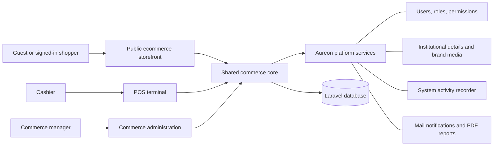

The three user surfaces share one transactional core. Neither storefront nor
POS maintains an independent product, price, stock, customer, or sales record.

## 1.1 Plugin-style Package Boundary

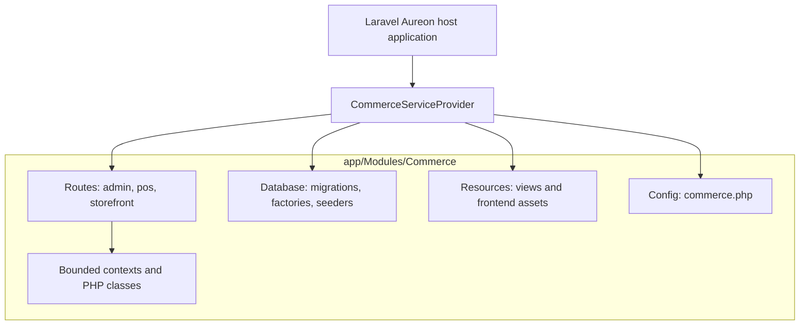

## 2. Module Boundaries

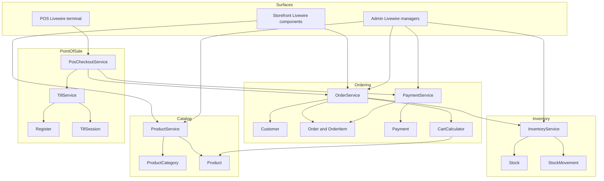

## 3. Entity Relationship Diagram

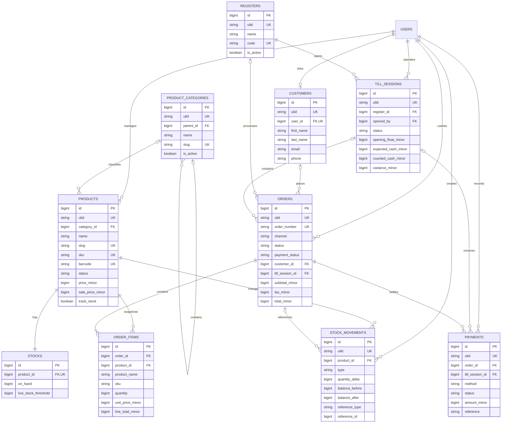

Media Library owns product gallery rows outside this domain diagram.

## 4. Migration Dependency Order

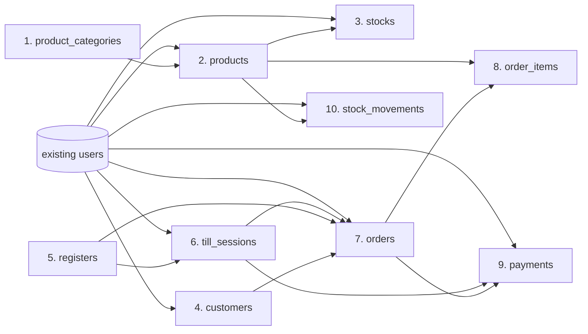

## 5. Storefront Request and Component Structure

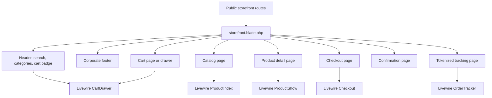

## 6. Web Order Placement Sequence

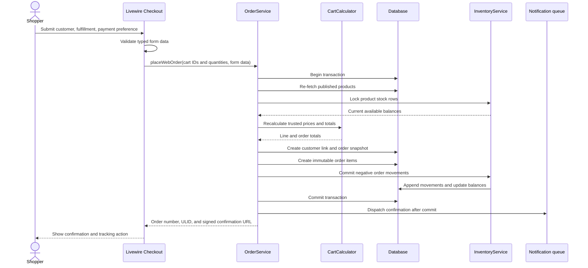

Any stock or validation failure rolls back the entire transaction and leaves the
cart available for correction.

## 7. POS Checkout Sequence

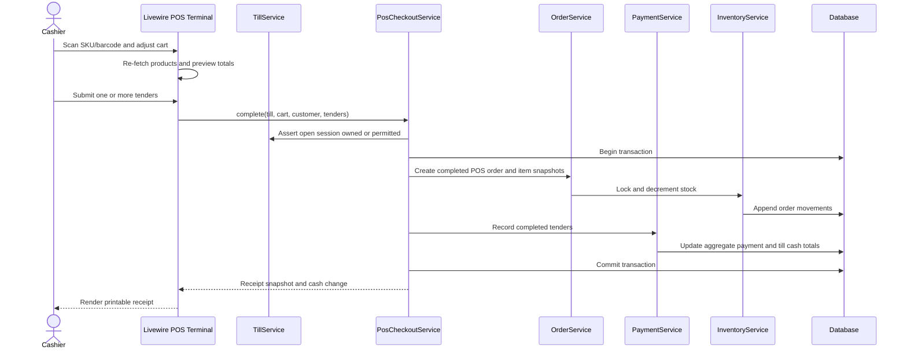

## 8. Order State Model

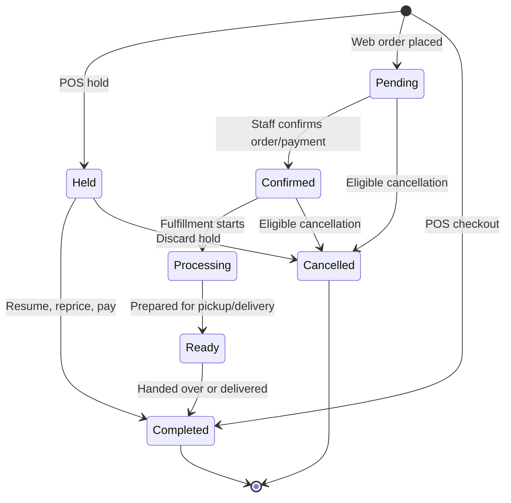

Rules:

- stock is not committed for `held` POS orders;
- stock is committed when a web order enters `pending`;
- stock is committed in the same transaction that creates a completed POS sale;
- eligible web cancellation restores stock once;
- completed POS sales require a future return/refund module.

## 9. Till State and Cash Reconciliation

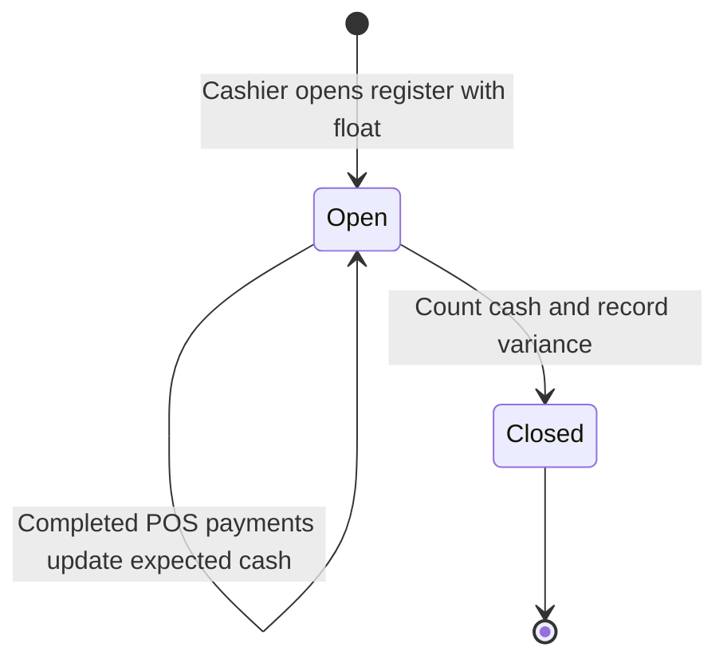

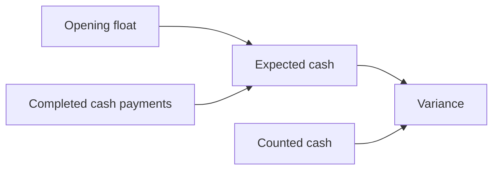

Version one does not include pay-in/pay-out cash movements. If that workflow is
approved later, add a dedicated append-only `till_cash_movements` table and
include it in expected cash rather than overloading payments.

## 10. Authorization Boundary

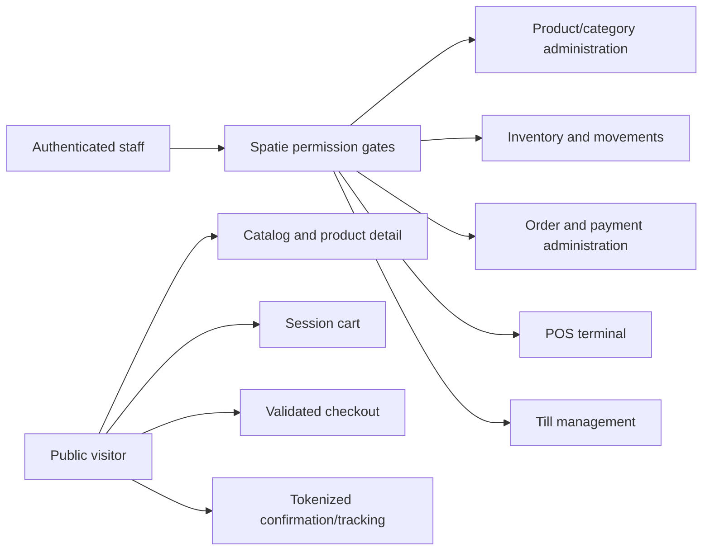

Sequential model IDs must never form the public authorization boundary for
confirmation or tracking.

## 11. Implementation Dependency Diagram

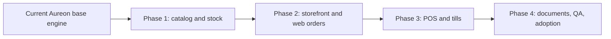

Each phase must end with focused tests, full regression, Pint, migration/seed
verification, route inspection, production asset build, responsive browser QA,
and module documentation before the next phase begins.
