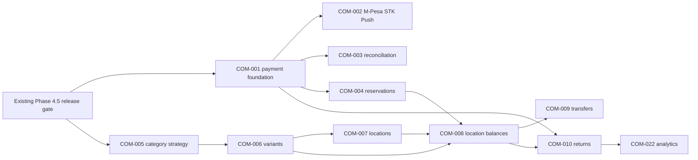

# Commerce Feature TODO Ledger

**Status:** Active planning ledger

**Baseline branch:** `feature/laravel-aureon-base-engine`

**Ledger branch:** `feature/commerce-todo-ledger`

**Baseline commit:** `58f23a5`

**Created:** 2026-08-26

## 1. Purpose

This ledger carries approved and candidate Commerce work beyond the implemented
POS and storefront baseline. It is ordered by architectural dependency and
adoption value, not by visual appeal or market popularity.

The ledger has three jobs:

1. prevent a feature from being inferred as implemented merely because an enum,
   placeholder, or extension note exists;
2. preserve the shared catalog, inventory, order, payment, and audit invariants
   while the module grows; and
3. give each future implementation branch one stable feature number whose
   status and evidence can be updated without renumbering the backlog.

This document is a planning artifact only. Creating it does not add migrations,
change seeders, alter application behavior, or approve every optional feature
for the core template.

## 2. Current Baseline

The following capabilities already exist and must not be recreated as parallel
systems:

- one module-owned catalog shared by the storefront and POS;
- hierarchical product categories using an adjacency-list `parent_id`, with
  self-parent and cycle protection;
- simple products that currently own SKU, internal and manufacturer barcodes,
  prices, tax settings, media, and stock policy;
- one locked stock projection per product plus an append-only movement ledger;
- unified web and POS orders with immutable customer, product, price, tax, and
  total snapshots;
- guest checkout, reusable customer resolution, signed confirmation/tracking,
  and order documents;
- manual web payment preferences and locally observed POS tenders, including
  exact split tender and cash change;
- register and till-session administration, held POS orders, browser receipt
  printing, PDF documents, reports, operational events, and queued mail;
- Commerce permissions, policies, system activity, dashboards, and optional
  demonstration seeders.

The important limitations are equally explicit:

- there is no external payment provider or durable provider-callback inbox;
- web checkout commits stock immediately and has no expiring reservation state;
- a product is the only saleable SKU; there are no saleable variants;
- category hierarchy is valid but has no agreed depth/query strategy for large
  catalogs;
- stock is not scoped to a store or warehouse, and registers are not bound to
  inventory locations;
- completed sales have no returns, exchanges, or refund workflow;
- delivery uses one configured flat fee;
- tax is one product rate, not a jurisdiction or fiscalization engine;
- the storefront is guest-first and has no authenticated customer portal;
- the only printer driver is the safe browser driver.

## 3. Required Precondition

The existing Phase 4.5 release gate in
`../commerce-phase-4-hardening-adoption-plan.md` remains a prerequisite for
declaring any new feature production-ready. At minimum, the current baseline
must retain clean migration, regression, build, browser, responsive,
accessibility, theme, print, PDF, queue, and deployment evidence.

This prerequisite is not assigned a new feature number because it is already
owned by the approved master plan.

## 4. Status Vocabulary

| Status | Meaning |
| --- | --- |
| `TODO` | Researched candidate retained for planning; implementation has not started. |
| `PLANNED` | Scope, dependencies, decisions, acceptance criteria, and delivery branch are approved. |
| `IN PROGRESS` | Implementation is active on the recorded branch. |
| `BLOCKED` | An explicit external or architectural decision prevents progress. |
| `DONE` | Code, tests, documentation, review, and required QA are merged into the base branch. |
| `DEFERRED` | Valid feature deliberately moved out of the active roadmap. |
| `DROPPED` | Feature is no longer intended; the row remains for historical traceability. |

Feature numbers are immutable. A split feature receives a new number; an old
number is never reused.

## 5. Priority Tiers

| Tier | Meaning |
| --- | --- |
| `F0` | Transaction or data-model foundation. Later work must not bypass it. |
| `F1` | Operational completeness needed by common production adopters. |
| `F2` | Scale, integration, resilience, or richer customer operations. |
| `F3` | Optional growth or vertical capability; keep outside core until demanded. |

## 6. Feature Ledger

| Feature number | Status | Tier | Feature name | Description | Rationale and dependency points |
| --- | --- | --- | --- | --- | --- |
| `COM-001` | `TODO` | `F0` | Payment gateway foundation | Add a module-owned `Payments` integration context with gateway contracts, immutable intent/result DTOs, durable payment attempts, provider identifiers, an authenticated callback/event inbox, idempotency keys, status transitions, retry/reconciliation services, and provider-safe metadata. Verified settlement must still pass through the existing locked `PaymentService`. | 1. External payment calls and callbacks are asynchronous and may be duplicated, delayed, or delivered out of order. 2. A provider-neutral boundary prevents M-Pesa logic from leaking into checkout, POS, orders, or reports. 3. Raw credentials, payloads, PAN/CVV, and unrestricted provider metadata must never enter logs, activity, notifications, or documents. 4. This is the prerequisite for `COM-002`, `COM-003`, and provider-backed refunds in `COM-010`. |
| `COM-002` | `TODO` | `F0` | M-Pesa Daraja STK Push | Implement the first `PaymentGateway` adapter for Daraja M-Pesa Express: environment-scoped credentials, access-token lifecycle, Kenyan phone normalization, STK initiation, order/amount/reference correlation, callback handling, timeout and customer-cancel states, transaction-status verification, sandbox fixtures, checkout feedback, administration diagnostics, and queue-safe events. | 1. The current `mobile_money` choice records only a manual preference and cannot prove collection. 2. STK Push is the highest-value local online payment path for the current `KE`/`KES` defaults. 3. Local payment completion must occur only after provider truth, amount, currency, order, and outstanding balance agree. 4. Depends on `COM-001`; must preserve manual M-Pesa as a configurable fallback during rollout. |
| `COM-003` | `TODO` | `F0` | M-Pesa C2B and payment reconciliation | Add optional PayBill/Till C2B confirmation intake, unmatched-receipt work queues, transaction-status queries, duplicate-reference controls, operator matching, settlement reports, and controlled reversal/refund handoff where the contracted Daraja product supports it. | 1. STK Push alone does not reconcile customers who pay manually to a Till or PayBill. 2. Unmatched, late, duplicate, overpaid, and underpaid receipts need explicit exception states instead of edits to completed payments. 3. Reconciliation separates provider settlement truth from order fulfillment decisions. 4. Depends on `COM-001` and the production credential/short-code decisions made for `COM-002`. |
| `COM-004` | `TODO` | `F0` | Payment-aware stock reservations and expiry | Introduce explicit available, reserved, committed, and released semantics for asynchronous web checkout, with reservation expiry, deterministic release jobs, payment-race locking, abandonment handling, and operator visibility. POS may continue immediate commit within its atomic sale. | 1. Current web orders immediately reduce on-hand stock even when payment remains pending. 2. Automated payments make abandoned or delayed payment attempts operationally significant. 3. Reservations must prevent oversell without permanently trapping stock. 4. Depends on `COM-001`; must be designed before multi-location allocation in `COM-008`. |
| `COM-005` | `TODO` | `F0` | Category taxonomy and hierarchy strategy | Retain the current safe adjacency-list hierarchy while an ADR measures catalog depth, subtree reads, reorder frequency, database support, and admin/storefront query plans. Decide between adjacency plus recursive CTEs, a closure table, materialized path, or nested sets; then add tree-aware navigation, breadcrumbs, move validation, depth limits, descendant counts, and scalable selection UI. | 1. Hierarchy and cycle protection already exist, so a blind nested-set rewrite would add migration risk without evidence. 2. Nested sets favor subtree reads but make moves expensive; adjacency remains simple and portable, and supported databases offer recursive CTEs. 3. Product categories, non-hierarchical tags, reusable attributes, and merchandising collections are different concepts and should not be collapsed into one table. 4. Independent of payment work, but should settle before large catalog imports and advanced faceting. |
| `COM-006` | `TODO` | `F0` | Saleable product attributes and variants | Introduce reusable attribute definitions/values and a `ProductVariant` saleable aggregate with its own SKU, internal/manufacturer barcode, price override, stock policy, state, option combination, weight/dimensions, and optional media. Migrate each existing simple product to one default saleable variant through a compatibility projection. | 1. Size, color, or configuration combinations require independently priceable and stockable SKUs. 2. Cart identity, barcode lookup, inventory locks, order snapshots, POS search, documents, reports, and media must all resolve the same saleable item. 3. Specifications JSON is presentation data and must not become unchecked variant storage. 4. This is the preferred prerequisite for location inventory, purchasing, transfers, and bundles. |
| `COM-007` | `TODO` | `F0` | Multi-store and inventory-location foundation | Add a single-institution location aggregate supporting store, warehouse, and fulfillment-location types; bind registers to one selling location; define active state, address/contact snapshots, timezone, fulfillment capabilities, and permission scope. This is multi-location operation, not SaaS multitenancy. | 1. Register free-text location labels cannot own inventory or authorize store-scoped operations. 2. Store identity is needed before balances, pickup promises, transfers, tills, reports, and notifications can be location-aware. 3. Tenant isolation is a separate architecture and must not be inferred from multi-store support. 4. Prefer `COM-006` first so balances attach to the stable saleable-item identity. |
| `COM-008` | `TODO` | `F0` | Location-aware inventory balances and allocation | Replace the single product balance with a balance per saleable item and stock location; define on-hand, available, reserved, committed, damaged, quality-control, and safety-stock projections; route POS, pickup, delivery, cancellation, thresholds, and reports through explicit allocation policy. | 1. A location dimension must apply consistently across stock locks, movements, orders, registers, reservations, and reports. 2. Physical stock and sellable stock are not always the same quantity. 3. Historical orders need immutable source/fulfillment location snapshots. 4. Depends on `COM-004`, `COM-006`, and `COM-007`. |
| `COM-009` | `TODO` | `F1` | Stock transfers and replenishment | Add transfer requests with source, destination, lines, dispatch, in-transit, partial receipt, damage/missing quantities, cancellation, reconciliation, actors, documents, and movement-ledger effects. Add low-stock replenishment suggestions without auto-ordering by default. | 1. Two manual adjustments cannot explain goods in transit or discrepancies. 2. Transfer state must drive balanced source/destination movements and an audit trail. 3. Suggested replenishment is useful before a full supplier purchasing engine and avoids speculative automation. 4. Depends on `COM-008`. |
| `COM-010` | `TODO` | `F1` | Returns, refunds, and exchanges | Add separate return authorization, return lines, eligibility rules, receipt/disposition, restock/damage/quarantine outcomes, provider/manual refund records, partial and mixed-tender allocation, credit notes, permissions, events, and net-sales reporting. Model an exchange as a return plus a new sale. | 1. Cancelling an unpaid order is not a completed-sale return. 2. Original order items, payments, tax snapshots, and stock movements must remain immutable. 3. Refund providers have their own asynchronous status and idempotency requirements. 4. Depends on `COM-001`; must target saleable items and locations when `COM-006` to `COM-008` are enabled. |
| `COM-011` | `TODO` | `F1` | Tax rules and fiscal-compliance adapters | Introduce a deterministic tax-quotation contract with tax classes, exemptions, inclusive/exclusive rules, line-level rounding, delivery/discount ordering, rule snapshots, and remittance exports. Add an optional Kenya eTIMS OSCU/VSCU adapter and compliant invoice/credit-note lifecycle without hard-coding KRA into the core calculator. | 1. The current single rate in basis points cannot represent jurisdiction, exemption, or fiscal submission state. 2. The template defaults to Kenya, where automated invoicing systems may require eTIMS system-to-system integration and certification. 3. Historical documents must remain explainable after tax rules change. 4. Compliance activation is adopter- and jurisdiction-specific and requires current professional validation. |
| `COM-012` | `TODO` | `F1` | Suppliers, purchasing, and receiving | Add supplier identities, purchase orders, approvals, expected dates, cost snapshots, partial receipts, rejected/damaged quantities, landed-cost inputs, cancellations, and stock movements. Keep accounts payable and general ledger posting behind an adapter. | 1. Manual stock adjustments do not explain procurement commitments or received cost. 2. Receiving is the natural source for on-hand inventory and margin inputs. 3. Supplier and purchase permissions should be separate from ordinary inventory adjustment rights. 4. Depends on `COM-006` and `COM-008`; can consume replenishment proposals from `COM-009`. |
| `COM-013` | `TODO` | `F1` | Stocktake, cycle count, and condition workflows | Add count sessions, count sheets, blind/recount options, expected-versus-counted variance, approvals, shrinkage/damage/quality-control reason codes, and compensating movements. Never edit or delete prior movements. | 1. A trusted physical count is different from an ad hoc quantity adjustment. 2. Variance ownership and approval are essential for store accountability. 3. Explicit unavailable states improve sellable-stock accuracy. 4. Depends on `COM-008`; may be implemented for one location first after its schema lands. |
| `COM-014` | `TODO` | `F1` | Promotions, coupons, and price rules | Add date-bounded and channel-aware fixed/percentage discounts, coupon codes, eligibility, usage limits, product/category targets, combination policy, manager overrides, and immutable line/order allocations. Preserve server-side calculation and integer minor units. | 1. The current sale price and POS fixed order discount cannot express reusable campaigns. 2. Discount allocation order affects tax, refunds, reporting, and rounding. 3. Rules must be previewable but revalidated under lock at checkout. 4. Depends on stable saleable-item identity from `COM-006`; loyalty redemption remains separate in `COM-024`. |
| `COM-015` | `TODO` | `F1` | Delivery zones and fulfillment operations | Replace the single flat fee with provider-neutral delivery quotes, zones, service levels, pickup locations, lead times, quote expiry, packing/picking states, partial fulfillment, shipment/tracking snapshots, and manual fallback. | 1. Shipping, local pickup, and delivery have distinct price and operational lifecycles. 2. Client-submitted delivery amounts cannot be authoritative. 3. Multi-location allocation and pickup promises require explicit fulfillment origin. 4. Depends on `COM-007` and `COM-008`; carrier APIs are adapters, not core order logic. |
| `COM-016` | `TODO` | `F1` | POS cash controls and supervisor approvals | Extend till operations with cash-in, cash-out, paid-out, safe drops, no-sale drawer events, reason codes, discount/void/refund approval thresholds, manager PIN or re-authentication, and exception reports. | 1. Expected cash currently changes mainly through opening float and completed cash sales. 2. Real tills need auditable non-sale cash movements and controlled overrides. 3. Approval must record the approving user without changing cashier ownership. 4. Depends on the existing till lock model; refund approvals also depend on `COM-010`. |
| `COM-017` | `TODO` | `F1` | Bulk catalog and inventory interchange | Add validated CSV/XLSX import previews, row-level errors, idempotent upsert keys, media mapping, category/variant resolution, stock opening/adjustment modes, bounded exports, queued large jobs, and rollback-safe audit summaries. | 1. Manual CRUD does not scale adoption of an established catalog. 2. Imports must never bypass domain services, identifier uniqueness, or stock movements. 3. Preview and deterministic error files reduce destructive correction work. 4. Should follow `COM-005` and `COM-006` so imported taxonomy and saleable identity are stable. |
| `COM-018` | `TODO` | `F2` | Authenticated customer account portal | Link application users to reusable customers with claim/merge safeguards, profile and address book, order history/detail, documents, saved preferences, and ownership policies while retaining signed guest access. | 1. Matching a mutable email alone is not authorization. 2. Accounts reduce repeat-checkout friction and enable later returns, loyalty, and saved addresses. 3. Duplicate resolution, email changes, archived customers, and historical guest claims need explicit rules. 4. Depends on the existing user/profile and customer boundaries; self-service returns depend on `COM-010`. |
| `COM-019` | `TODO` | `F2` | Direct POS hardware bridge | Implement a separately authenticated local/kiosk bridge for ESC/POS printing, printer health, duplicate-print protection, cash-drawer pulses, optional customer display, and scanner diagnostics while preserving browser/PDF fallback. | 1. Ordinary browser JavaScript cannot promise silent printing or unrestricted device access. 2. Hardware credentials and raw payment data must stay outside browser events and receipts. 3. Device timeout, offline state, retry, and operator fallback must be explicit. 4. Extends the existing `ReceiptPrinterDriver`; does not replace it. |
| `COM-020` | `TODO` | `F2` | Offline and degraded-mode POS | Define an explicit risk-bounded mode for catalog cache, cash-only or approved tender rules, locally durable operation IDs, conflict detection, replay, stock reconciliation, expiry, device ownership, and clear operator recovery. | 1. Offline selling is a distributed-systems feature, not a service-worker toggle. 2. Stale price, stock, permissions, till state, and duplicated replay can create financial loss. 3. Cash-only degraded mode may be a smaller first delivery than offline card/mobile-money capture. 4. Depends on stable location, saleable-item, till, and idempotency contracts. |
| `COM-021` | `TODO` | `F2` | External API, webhooks, and accounting adapters | Add versioned authenticated APIs and an outbox-backed outbound webhook system with signed payloads, endpoint ownership, secret rotation, delivery attempts, retry/circuit breaker, replay tools, privacy projections, and adapter contracts for accounting/ERP sync. | 1. A failed external delivery must not roll back or misrepresent a committed sale. 2. Integration payloads require stable identifiers and immutable snapshots. 3. Accounting mappings vary by adopter and should not enter core order services. 4. Depends on the relevant domain feature; payment callbacks remain owned by `COM-001`. |
| `COM-022` | `TODO` | `F2` | Commerce reporting and margin analytics | Extend the existing dashboard/reports with gross versus net sales, returns, tax, tender settlement, location/channel performance, COGS, gross margin, cashier exceptions, stock aging, sell-through, and queued exports. Define every metric before SQL and preserve accessible table alternatives. | 1. Existing reports cover the operational baseline but not procurement cost, returns, or location-aware margin. 2. COGS requires cost snapshots from products or purchasing, not current mutable cost alone. 3. Large reports require measured indexes and queued protected artifacts rather than unbounded requests. 4. Depends on the feature that supplies each metric, especially `COM-010` and `COM-012`. |
| `COM-023` | `TODO` | `F2` | Catalog discovery and merchandising | Add reusable filters/facets, non-hierarchical tags, curated collections, search weighting, synonyms, pinned products, related-product rules, and measured database-first search with an optional external index adapter. | 1. Categories, tags, attributes, and curated collections solve different discovery problems. 2. Search results must still revalidate publication, price, and stock at checkout. 3. Private cost/customer/payment data must never enter a public index. 4. Depends on `COM-005` and `COM-006`; external search requires measured need and a database fallback. |
| `COM-024` | `TODO` | `F3` | Loyalty, store credit, and gift cards | Add separate ledger-backed programs for earning/redemption, store-credit grants/spend, and gift-card issue/activation/reload/redemption, with expiry policy, fraud controls, customer linkage, split-tender behavior, refunds, and audit. | 1. These are monetary liabilities and must not be represented by a mutable points or balance column alone. 2. Redemption changes order discount/payment allocation and refund behavior. 3. Useful for repeat business but not required for the core transaction engine. 4. Depends on `COM-018`, and gift-card/store-credit refunds depend on `COM-010`. |
| `COM-025` | `TODO` | `F3` | Bundles, kits, and composite saleables | Add explicit bundle definitions and component quantity rules, with pricing, availability, stock commitment/release, order snapshots, barcode/POS behavior, and return policy. | 1. A bundle that consumes several SKUs is not a product variant. 2. Component inventory must be locked and moved deterministically. 3. Prebuilt kits and dynamic bundles may need different stock policy. 4. Depends on `COM-006` and `COM-008`; remains optional until an adopter requires it. |
| `COM-026` | `TODO` | `F3` | B2B quotes, invoices, and price lists | Add customer/group price lists, quotations with expiry/versioning, approval, quote-to-order conversion, purchase-order references, payment terms, invoices/statements, and organization customer roles. | 1. B2B commitments and terms are different from a retail cart or completed tax invoice. 2. Historical quote and price-list snapshots must survive later catalog changes. 3. This adds authorization and receivables concerns beyond the initial retail scope. 4. Depends on `COM-018`; tax documents must align with `COM-011`. |
| `COM-027` | `TODO` | `F3` | Multi-currency and localization | Add currency-aware price books, supported currency/rounding metadata, explicit conversion-rate snapshots, locale-aware content, translated catalog fields, and settlement/reporting rules. Do not convert historical integer amounts with floats. | 1. Display currency, order currency, provider settlement currency, and accounting currency can differ. 2. Multi-currency affects every total, refund, report, gateway, and document contract. 3. It is high-impact but unnecessary for many single-country adopters. 4. Depends on provider and tax decisions; should remain deferred until a concrete adopter requires it. |
| `COM-028` | `TODO` | `F3` | Traceability and variable-measure inventory extensions | Define optional, separately adoptable support for units of measure, weighted items, batch/lot, serial number, manufacture/expiry dates, and recall/trace reports. Use GS1-compatible identifiers where applicable. | 1. Grocery, pharmacy, electronics, and manufacturing have materially different traceability rules. 2. Forcing every adopter into lot/serial storage would overcomplicate simple retail. 3. A trade-item variant and an individual serialized unit are different identities. 4. Depends on `COM-006` and `COM-008`; each vertical subset requires its own approved plan. |

## 7. Recommended Delivery Sequence

The table order is the default implementation sequence, but independent ADR or
documentation work may run in parallel. The critical dependency spine is:

Recommended implementation slices:

1. **Payments:** `COM-001` through `COM-004`.
2. **Saleable catalog:** `COM-005` and `COM-006`.
3. **Multi-store inventory:** `COM-007` through `COM-009`.
4. **Operational completion:** `COM-010` through `COM-017`.
5. **Adoption and resilience:** `COM-018` through `COM-023`.
6. **Optional growth/verticals:** `COM-024` through `COM-028` only when an
   adopter supplies a real use case.

## 8. Scope Decisions Already Hardened

### 8.1 Category hierarchy

The current adjacency-list schema is not a defect. The hierarchy feature starts
with an ADR and query measurement. Nested sets are one candidate, not the
preselected answer. The decision must account for:

- supported MySQL/MariaDB versions and recursive CTE behavior;
- expected maximum depth and category count;
- frequency of subtree reads versus category moves/reordering;
- cycle prevention and concurrent moves;
- storefront breadcrumb, descendant filter, and admin-tree needs;
- migration rollback and database portability.

### 8.2 Variants before broad inventory expansion

Future inventory should target one stable saleable-item identity. Implementing
locations against products and then adding variants would force a second
high-risk inventory migration. Existing simple products must remain usable
through a default-variant compatibility path.

### 8.3 Multi-store is not multitenancy

The planned scope is multiple outlets and warehouses owned by one configured
institution. Separate tenant databases, tenant-scoped users, per-tenant themes,
billing, and cross-tenant isolation are not implied by `COM-007`.

### 8.4 Payment and card-data boundary

The application should prefer provider-hosted, tokenized, or certified device
flows. It must not collect or persist card PAN or CVV. Any future card gateway or
terminal integration requires an explicit PCI DSS scope review by the adopter.

### 8.5 Fiscalization is an adapter

Kenya eTIMS is important for the template's current `KE`/`KES` posture, but tax
and fiscal submission remain separate contracts. An adopter that does not use
KRA must be able to omit the adapter without forking the core calculator.

## 9. Features Deliberately Not Promoted To Core TODOs

The following are common in some commerce products but do not currently justify
core schema work. They should receive new immutable feature numbers only after
an adopter presents a concrete workflow:

- product reviews, ratings, wishlists, comparison, and social proof;
- abandoned-cart campaigns and marketing automation;
- subscriptions, pre-orders, try-before-you-buy, and digital downloads;
- marketplace/multi-vendor commissions and seller settlement;
- restaurant table plans, kitchen display, recipes, and ingredient depletion;
- appointments, rentals, ticketing, and service-resource scheduling;
- franchise or SaaS tenant isolation;
- AI recommendations, demand forecasting, and dynamic pricing;
- cryptocurrency payment and speculative tender types.

This boundary keeps the base useful without turning it into several unrelated
vertical products.

## 10. Definition Of Ready

Before a row moves from `TODO` to `PLANNED`, its implementation plan must record:

- factual current-state audit and affected module ownership;
- explicit use cases, non-goals, terms, state transitions, and failure paths;
- dependency decision and backward-compatible migration/backfill strategy;
- money, identifier, snapshot, stock-ledger, and lock-order effects;
- routes, permissions, policies, ownership, and activity events;
- provider/configuration/secrets boundary where relevant;
- queued event, retry, idempotency, and reconciliation behavior;
- test matrix, browser/accessibility/theme/print scope, and adopter docs;
- delivery branch and expected implementation record.

## 11. Definition Of Done

A feature may move to `DONE` only when:

1. implementation and focused tests are merged into
   `feature/laravel-aureon-base-engine`;
2. migrations contain complete comments, indexes, constraints, and reversible
   behavior appropriate to the repository standard;
3. services own multi-model writes and Livewire/controllers remain orchestration
   boundaries;
4. authorization, inactive users, module-disabled behavior, and system-admin
   behavior are verified;
5. queue, callback, duplicate, stale-state, rollback, and privacy paths are
   tested where applicable;
6. full regression and required browser, responsive, accessibility, theme,
   print, PDF, and build checks pass;
7. implementation, adoption, operations, glossary, extension, and screenshot
   documentation is updated where affected;
8. the row records the merge commit, implementation document, completion date,
   and any residual deferred scope.

## 12. Research Findings Applied To This Ledger

### 12.1 Payments

Safaricom's Daraja portal exposes M-Pesa APIs and a specific M-Pesa Express
simulation surface. Provider integrations must still be implemented from the
authenticated sandbox contract available to the adopting organization.

Stripe's official webhook guidance is used only as a provider-neutral delivery
reference: callbacks can be retried, duplicated, and delivered out of order;
endpoints should authenticate events, respond promptly, and process idempotently.
Its idempotency guidance reinforces stable request keys for retried mutations.

### 12.2 Catalog and inventory

Shopify and WooCommerce both model variants as the saleable choices beneath a
product, with variant-level price, availability, SKU, media, or stock behavior.
Shopify models inventory levels by inventory item and location. Square likewise
tracks inventory for item variations at locations and distinguishes calculated
counts, physical counts, adjustments, receipts, waste, and transfers.

These references support `ProductVariant` plus location-owned inventory; they
do not require copying either platform's schema.

### 12.3 Categories and discovery

WooCommerce distinguishes hierarchical categories from non-hierarchical tags
and reusable attributes. Shopify maintains a separate standardized product
taxonomy. MySQL and MariaDB document recursive CTEs for hierarchical data. These
facts support an ADR that preserves the current adjacency model until measured
read/write needs justify a different tree representation.

### 12.4 Returns and refunds

Shopify treats return intent, processing, restock disposition, exchange, and
refund as lifecycle concerns. Square models refunds as separate records with
their own status and supports partial refunds. These patterns support separate
return/refund aggregates rather than rewriting the original sale.

### 12.5 Compliance and payment security

KRA documents OSCU/VSCU system-to-system integration for automated invoicing
systems. PCI SSC states that systems storing, processing, or transmitting card
data are in scope and describes provider-hosted/tokenized/P2PE approaches as
ways to reduce exposure, not remove merchant responsibility.

### 12.6 Optional customer growth

Square exposes customer, loyalty, and gift-card capabilities as distinct APIs,
and Shopify's customer-account surface treats buyer authentication and order
ownership as a separate boundary. This supports keeping customer accounts,
loyalty, store credit, and gift cards independent instead of adding generic
balance fields to the current customer table.

## 13. Primary Research Register

Research was reviewed on 2026-08-26. These are primary vendor, standards-body,
database, or regulator sources; they inform requirements but do not replace an
implementation-phase review of the currently contracted API/version.

| Concern | Primary source | Ledger consequence |
| --- | --- | --- |
| M-Pesa APIs | [Safaricom Daraja API catalog](https://developer.safaricom.co.ke/apis) and [M-Pesa Express simulation](https://developer.safaricom.co.ke/apis/MpesaExpressSimulate) | Provider adapter, sandbox verification, callback/status lifecycle, and manual fallback. |
| Idempotent requests | [Stripe idempotent requests](https://docs.stripe.com/api/idempotent_requests) | Stable operation keys and safe retry behavior in the provider-neutral payment core. |
| Webhook delivery | [Stripe webhook guidance](https://docs.stripe.com/webhooks) | Authentication, duplicate/out-of-order tolerance, prompt response, queue processing, and replay protection. |
| Product variants | [Shopify Storefront Product](https://shopify.dev/docs/api/storefront/latest/objects/Product) and [WooCommerce variable products](https://woocommerce.com/document/variable-product/) | One product can expose multiple independently selectable saleable variants. |
| Category/attribute separation | [WooCommerce product taxonomies](https://woocommerce.com/document/managing-product-taxonomies/) | Keep categories, tags, attributes, and variant options conceptually separate. |
| Standard taxonomy | [Shopify Standard Product Taxonomy](https://shopify.github.io/product-taxonomy/) | Optional mapping/reference; do not hard-code one adopter's category tree as a global standard. |
| Hierarchy queries | [MySQL recursive CTEs](https://dev.mysql.com/doc/refman/8.0/en/with.html) and [MariaDB recursive CTEs](https://mariadb.com/docs/server/reference/sql-statements/data-manipulation/selecting-data/common-table-expressions/recursive-common-table-expressions-overview) | Measure adjacency plus recursive queries before selecting nested sets or another representation. |
| Variant/location inventory | [Shopify InventoryItem](https://shopify.dev/docs/api/admin-graphql/latest/objects/InventoryItem) | Inventory identity belongs to a saleable item and can have levels at multiple locations. |
| Inventory states | [Shopify inventory quantities and states](https://shopify.dev/docs/apps/build/orders-fulfillment/inventory-management-apps/manage-quantities-states) | Distinguish on-hand, available, committed, reserved, damaged, safety, and quality-control quantities. |
| Counts and adjustments | [Square Inventory API](https://developer.squareup.com/docs/inventory-api/what-it-does) | Preserve physical counts, calculated counts, reasoned adjustments, receipts, waste, and traceable sources. |
| Transfers | [Square Transfer Orders API](https://developer.squareup.com/docs/transfer-orders-api) | Use a transfer aggregate and lifecycle rather than unrelated manual adjustments. |
| Returns | [Shopify returns architecture](https://shopify.dev/docs/apps/build/orders-fulfillment/returns-apps) | Separate return intent, eligibility, processing, disposition, exchange, and financial action. |
| Refunds | [Square refund guidance](https://developer.squareup.com/docs/payments-api/refund-payments) | Separate asynchronous refund status, partial amounts, provider references, and idempotency. |
| Taxes/discounts | [Square taxes and discounts](https://developer.squareup.com/docs/orders-api/apply-taxes-and-discounts) and [WooCommerce coupons](https://woocommerce.com/document/coupon-management/) | Define line/order scope, allocation, combination, tax order, and immutable snapshots. |
| Fulfillment | [Shopify delivery and shipping](https://shopify.dev/docs/apps/build/checkout/delivery-shipping) | Model shipping, pickup, rates, locations, and fulfillment groups explicitly. |
| Customer accounts | [Shopify Customer Account API](https://shopify.dev/docs/api/customer/latest) | Authenticate buyer ownership for orders, profiles, and addresses; keep guest signed access. |
| Loyalty/gift cards | [Square customer APIs](https://developer.squareup.com/docs/customers) | Keep customer directory, loyalty, and stored-value ledgers as distinct capabilities. |
| Product identity | [GS1 GTIN](https://www.gs1.org/standards/id-keys/gtin) and [GS1 barcodes](https://www.gs1.org/standards/barcodes) | Preserve unique trade-item and barcode identity at the saleable-item level. |
| Kenya fiscalization | [KRA eTIMS system-to-system information](https://www.kra.go.ke/services/service/16) and [OSCU specification](https://kra.go.ke/images/publications/OSCU_Specification_Document_v2.0.pdf) | Implement fiscal submission as an optional certified adapter with invoice/credit-note state. |
| Card-data security | [PCI SSC merchant guidance](https://www.pcisecuritystandards.org/merchants/) and [P2PE guidance](https://www.pcisecuritystandards.org/standards/point-to-point-encryption-p2pe/) | Avoid raw card data; prefer hosted/tokenized/certified terminal flows and require adopter compliance review. |

## 14. Ledger Update Record

| Date | Change | Branch/commit | Notes |
| --- | --- | --- | --- |
| 2026-08-26 | Created `COM-001` through `COM-028` from the merged Commerce baseline and primary-source research. | `feature/commerce-todo-ledger` | No application, migration, configuration, fixture, seeder, or database changes. |
