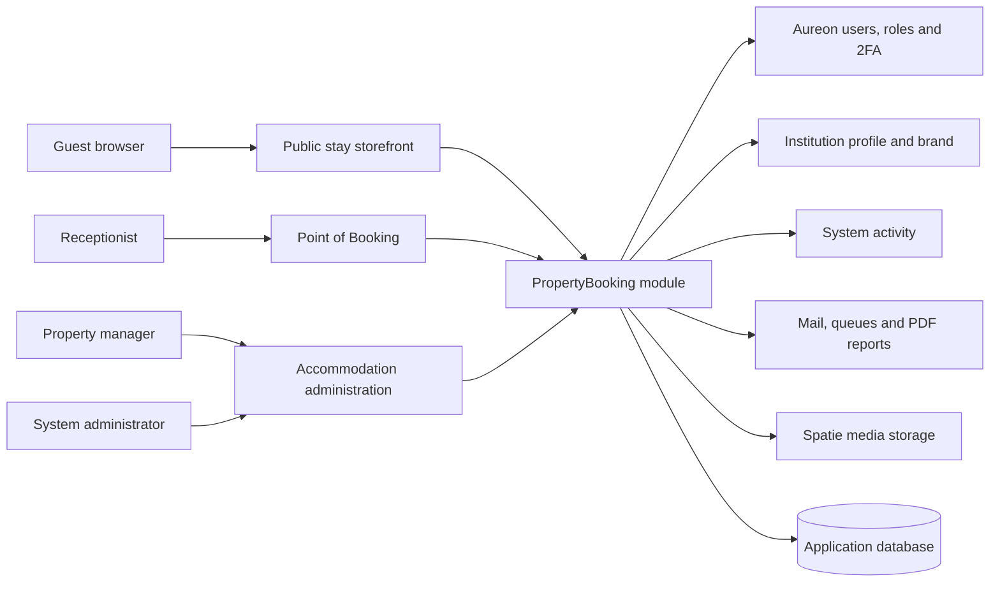
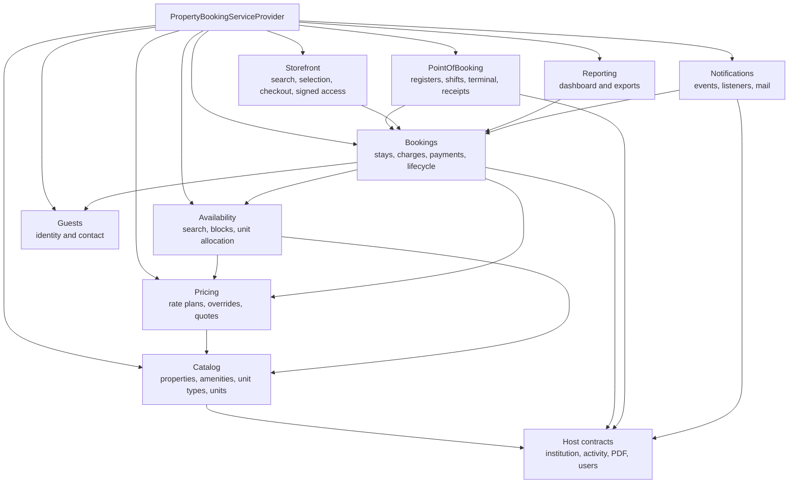
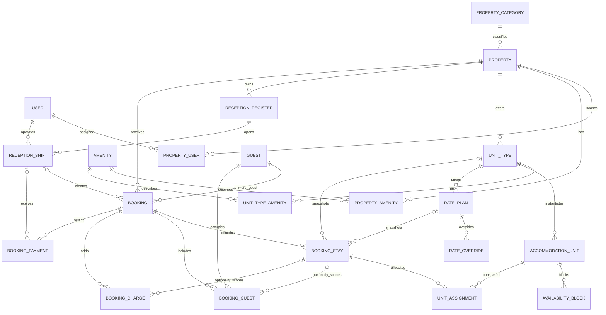
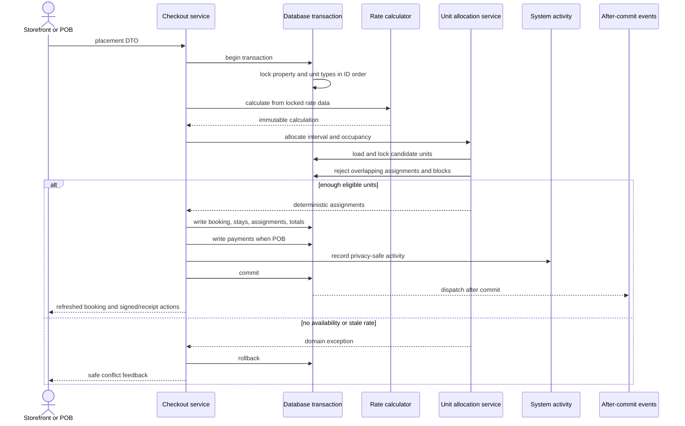
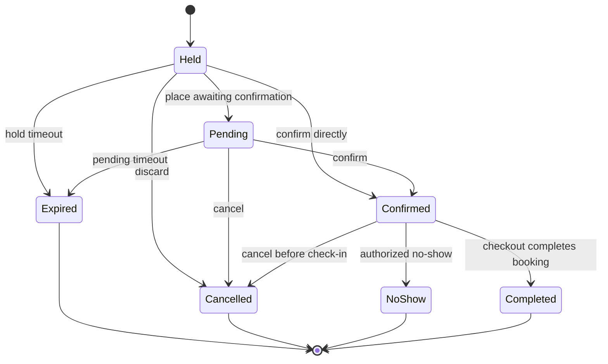
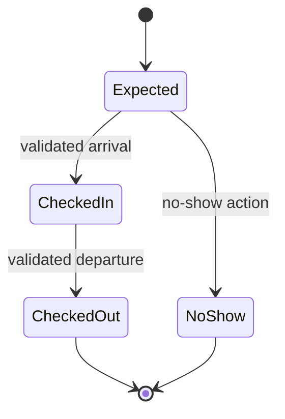
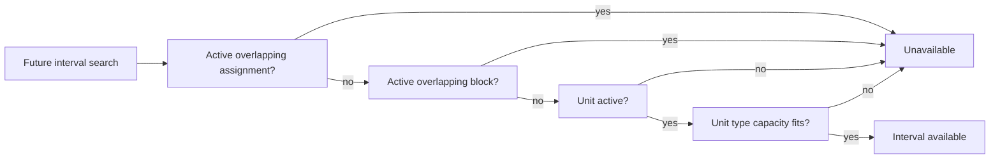
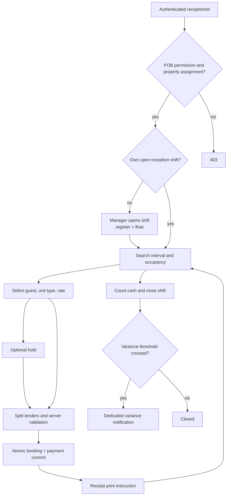
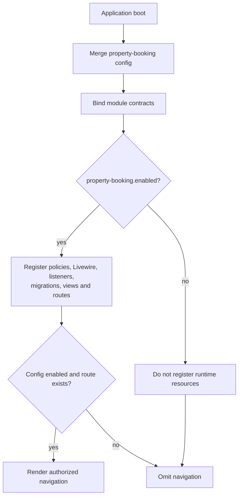
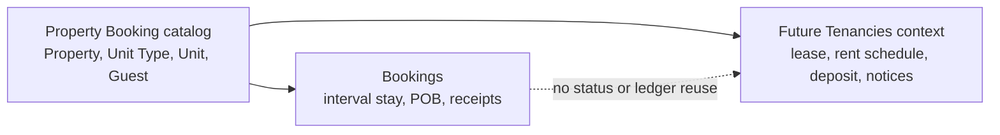

# Property Booking Module Diagrams

**Status:** Foundation and Phase 2 catalog/availability paths are implemented; later-phase paths remain the visual contract.

## 1. System Context

## 2. Bounded Contexts

Arrows are dependency direction. Catalog does not depend on Bookings, and no
context depends on Commerce.

## 3. Core Entity Relationships

## 4. Availability Transaction

## 5. Booking And Stay States

Payment state is calculated separately and therefore is not drawn as a booking
transition.

## 6. Unit Readiness And Availability

For immediate check-in, `ready` is an additional requirement. Dirty or cleaning
does not by itself erase a non-overlapping future reservation.

## 7. POB Shift And Payment Flow

## 8. Runtime Module Toggle

Disabling is runtime unregistration, not destructive schema or media removal.

## 9. Future Tenancy Boundary

