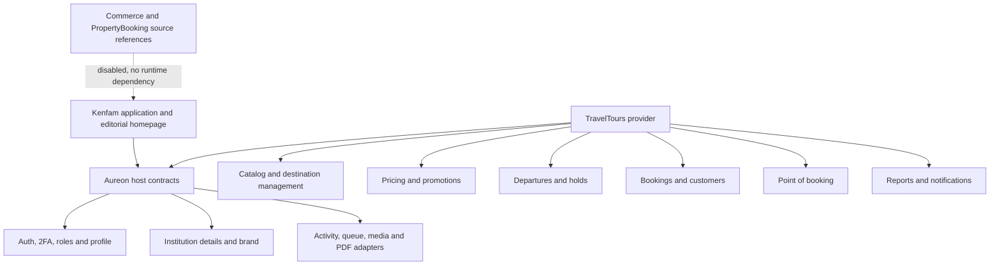
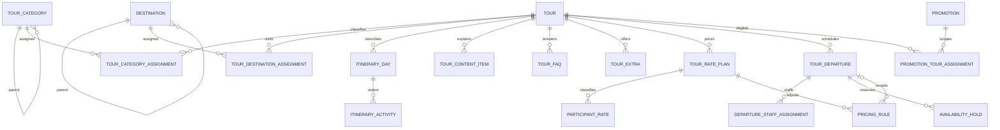
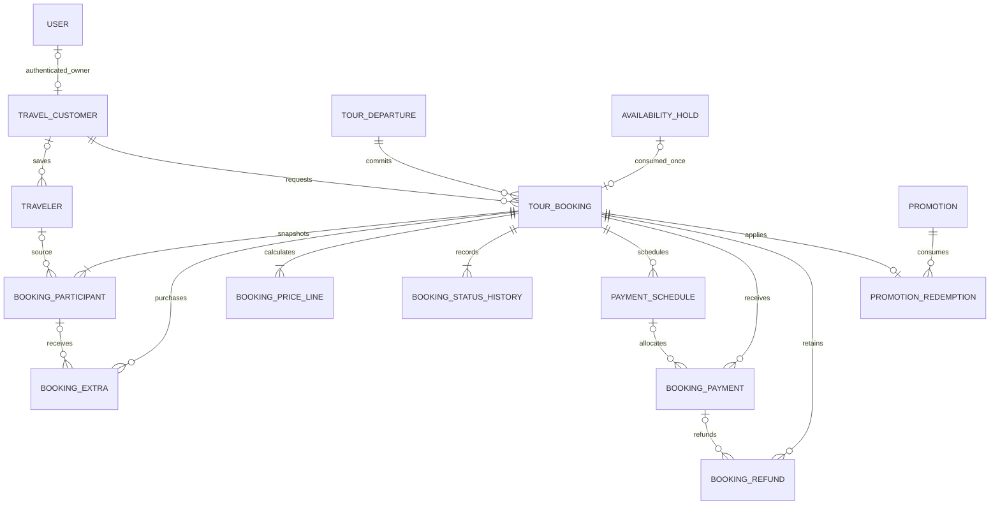
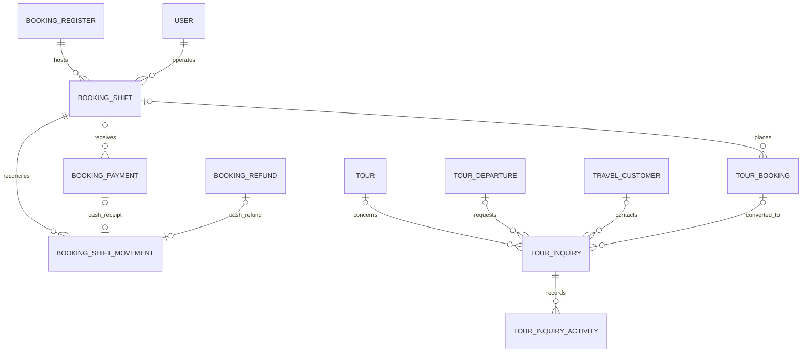
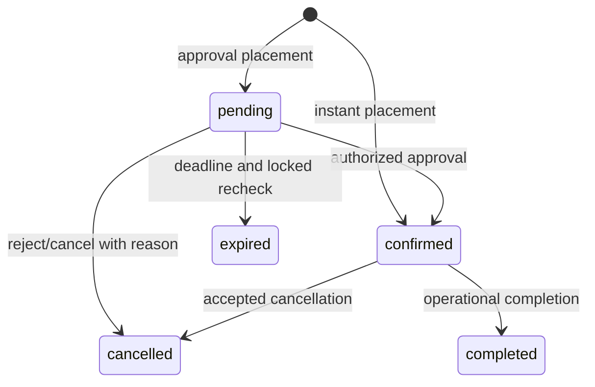
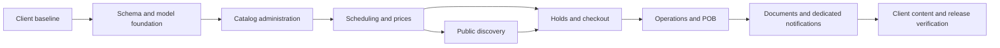

# TravelTours Architecture And Workflow Diagrams

Status: target design, not deployed evidence. Diagrams use Mermaid; accompanying
text remains readable without a renderer. The data dictionary is authoritative
for exact fields and FK behavior.

## 1. Host And Module Dependency Direction



There is no arrow from TravelTours to a reference module. Client-specific content
flows into institution/branding adapters, not into generic module configuration.

## 2. Catalog, Scheduling And Price Relations



Optional same-tour relationships are validated by services; individual foreign
keys alone cannot prove that a departure's selected rate belongs to its tour.

## 3. Booking, Customer And Financial Relations



Commercial snapshots are independent of later catalog/profile edits. Optional
source links never imply snapshots may be erased.

## 4. Desk And Inquiry Relations



One open shift per register/operator uses database guards and service locking.
An inquiry is capacity-neutral until the booking transaction succeeds.

## 5. Placement Sequence And Failure Boundary

```mermaid
sequenceDiagram
    actor Guest
    participant UI as Livewire Form
    participant Service as Booking service
    participant DB as Database transaction
    participant Quote as Quote engine
    participant Queue as After-commit delivery
    Guest->>UI: Submit participant/contact data and owned hold
    UI->>Service: Validated DTO, actor context, operation key
    Service->>DB: Lock departure then hold; check retry/owner/expiry
    Service->>Quote: Recalculate from current server data
    Quote-->>Service: Lines, totals, currency and version
    Service->>DB: Recheck capacity and promotion under locks
    alt Valid commitment
        Service->>DB: Booking, participants, prices, history, schedule, redemption
        Service->>DB: Consume hold and commit
        Service->>Queue: Dedicated booking event
        Service-->>UI: Signed confirmation result
    else Invalid or persistence failure
        Service->>DB: Roll back all changes
        Service-->>UI: Typed recoverable failure
    end
```

No notification is sent before commit. A browser total or valid fingerprint
does not bypass recalculation, authorization or capacity checking.

## 6. Independent Lifecycle States



Payment state is separate: unpaid -> partial -> paid; processed refunds produce
partially_refunded/refunded based on net received. Neither payment confirmation
nor refund silently changes the booking lifecycle.

## 7. Dependency-Ordered Delivery



Services are developed before their UI actions. Financial/concurrency tests are
gates, not a later cosmetic QA phase.
